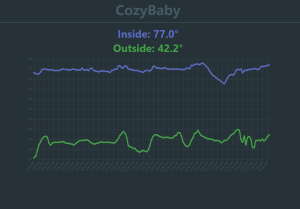

# CozyBaby
[](https://lbesson.mit-license.org/)




## Table of Contents
* [Usage](#Usage)
* [Stack](#Stack)
* [Installation](#Installation)
* [License](#License)

## Description
CozyBaby is my custom solution to monitor the temperature in my baby's room. We live in an old building with manual heat controls, so every night we look at the predicted low temperature for the night, then try to guess what level to set the heaters at and how warmly to dress him. I wanted to see how cold it really is in there, and how much the heat fluctuates based on the outside temperature. I realized that this problem gave me the perfect excuse to buy another Raspberry Pi! (I already have a Zero W that has served as a wireless print server, and is now a BlueTooth receiver for my stereo). 

After some initial research, I settled on using a Raspberry Pi Zero W with an AdaFruit PCT2075 temperature sensor. I don't have a soldering iron, so I went the solder-free route by purchasing a hammer header for the Pi, a STEMMA QT cable, and SparkFun STEMMA QT shim to connect everything together. Every hour, the Raspberry Pi reads the temperature from the sensor, gets the outdoor temperature from Open Weather API, and then uploads both values to an Atlas MongoDB instance. The code for the Raspberry Pi is found in the "raspberry_pi" folder. 

The backend is handled by an AWS Lambda function written in Python. The code for that is found in the "aws_lambda" folder. 
Finally, the React front end is hosted on netlify at https://cozy-baby.netlify.app and the code for that is found in "react_frontend."

This was in concept one of the simpler apps I've created, but allowed me to explore using a Raspberry Pi and dive into the world of serverless functions.

## Usage
Very simple! Just go to https://cozy-baby.netlify.app and take a look!

## Stack
CozyBaby is built with Python, MongoDB, React, Typescript, ChartJS, and AWS Lambda Functions

## Installation
Most of the work of getting this app working was in the setup of the Raspberry Pi and the AWS Lambda. Having successfully fumbled my way through it, hopefully the following description can help anyone hoping to replicate this app locally, or set up something similar.
First step - Acquiring the materials:
I purchased everything from AdaFruit because I've had good results from them before, but there are many other great vendors as well.
1. [Raspberry Pi Zero W](https://www.adafruit.com/product/3400). I don't need much processing power, so I decided to keep things small and cheap with the Pi Zero. The W model has a built in WiFi card, which makes connecting to your wireless network a breeze.
2. [MicroSD card](https://www.adafruit.com/product/2820). I didn't have a spare one lying around, so I bought one with Raspbian Buster Lite pre-flashed. It's not so much trouble to flash your own image, but since I had to buy a card anyway, why not save myself a step!
3. [PCT2075 Temperature Sensor](https://www.adafruit.com/product/4369). This is where the magic happens. On the product page AdaFruit also has great resources on how to get this little sensor set up with any board. Their documentation is great and was my main source of information for this part of the project.
4. [Hammer Header](https://www.adafruit.com/product/3662). AdaFruit also sells a Pi Zero W with a pre-soldered header. If you have a soldering iron, you can also forgo a header and just solder wires directly to the board.
5. [STEMMA QT 4-pin cable](https://www.adafruit.com/product/4210). This connects your Pi and PCT2075. It's a nice little standardized plug that saves soldering and looking at pin-out diagrams. For my setup I plugged this cable into the SHIM below. For going the soldering route, you can either buy STEMMA QT cable that just has loose wires on one end to solder onto the Pi, or just forgo the plug entirely and solder on both ends using whatever wire you have lying around.
6. [STEMMA QT SHIM](https://www.adafruit.com/product/4463). The final piece in my setup here. This just slots onto the header of the Pi and has a little STEMMA QT plug. I liked going this route for my setup because it eliminates the possibility of not soldering the wires correctly, or putting them in the wrong place. As I get more comfortable with these types of projects I'll probably choose to go the slightly cheaper route.

Speaking of cost, If you've been clicking on the links above you've noticed that this is not an expensive setup. I think all told my final bill was around $40. Amazing! 

We are missing just two things that I assume pretty much everyone has lying around the house in our modern era. A micro USB cable and a power supply. I've just used on of the multitude of cables and power supplies that I have lying around from old phones and kindles and other devices. Do just make sure that it's a 5V power supply. Anywhere from 1 to 2.5 Amps seems to be fine. 

Next step, stick it all together!

For this step just follow the instructions provided with the equipment that you've purchased. If you've purchased the hammer header above, you may consider trimming it down so that you're only installing the pins that you need. It makes for a less bulky setup and you can always save those pins for later. 

Now that you have your temperature sensor connected to your RaspberryPi it's time to get everything up and running! 

I use a headless setup, meaning that I don't plug a keyboard and moniter into my RaspberryPi, I just access it from my MacBook. One way to do this is through SSH. SSH is disabled by default in Raspian, the RaspberryPi operating system. To enable it, plug your sd card into your computer and create an empty file named "ssh" (no file extension) right at the root of the boot partition. If you have multiple partitions, the boot partitian should be the smallest partition and you'll see it contains key operating system files. While we're in there, we can go ahead and set up our wireless credentials. Raspian has a very user friendly utility for configuring wifi credentials and other basic things that can be accessed with the command raspiconfig, but we don't have access to that utility until we can ssh into our Pi. So, we'll do it the manual way just this once. 
Right in the same folder where we created the ssh file, create a file called "wpa_supplicant" and paste the following code into it, filling in your own information.

```ctrl_interface=DIR=/var/run/wpa_supplicant GROUP=netdev
update_config=1
country=<Insert 2 letter ISO 3166-1 country code here> (US, for example)

network={
 ssid="<Name of your wireless LAN>"
 psk="<Password for your wireless LAN>"
}
```

Great, now we should be good to go! Plug your Pi into power, give it a minute or two to boot up and then try the following commands in your terminal.
(Quick note: If you are on Windows there are some other steps you may need to do first... The RaspberryPi Docs can help you out [here](https://www.raspberrypi.org/documentation/remote-access/ssh/))

`ssh-keygen -R raspberrypi.local`
`ssh pi@raspberrypi.local`

The second command should prompt you for a password (the default is "raspberry"), enter that and you're in!

Now to get the code!

First install git with:
`sudo apt-get update`
`sudo apt-get install git`

Then clone this repo with `git clone https://github.com/elijah415hz/cozy-baby.git` 

This will prompt you for your github username and password.

(This is the http link, which is deprecated. But as long as it still works is perfect for this kind of thing. Do I want to go through setting up an ssh key just to clone this one repo? Not really... If you'd like to go the ssh key route, here is the info on how to do that. [Feel free!](https://docs.github.com/en/github/authenticating-to-github/generating-a-new-ssh-key-and-adding-it-to-the-ssh-agent))

Almost there.

Now, `cd cozy-baby/raspberry_pi`, then `pipenv install`. This will install all necessary dependencies. Then, create a ".env" file with the following contents, filling in the appropriate values.

```
DB_URI = <Your MongoDB URI>
LATITUDE = <Your Latitude>
LONGITUDE = <Your Longitude>
```

Oh wait! What's that MongoDB URI about? We're going to need to create a MongoDB instance in order to store our data. Let's jump back into our development computer and get that going. It will just take a minute, and then we'll have that DB_URI that our script needs. We can host it for free on MongoDB Atlas. Follow this link for their tutorial to get setup https://docs.atlas.mongodb.com/getting-started/. Once you have your connection string, bring that back here and paste it into the ".env" as your DB_URI.

Now we need to bring in cron. Cron enables us to run jobs on a schedule, often used for dev-ops purposes. We're going to use it to call our "log_temperatures.py" script every hour. If you'd like more granular data, I'll show you how to tell cron to call this script at any interval you'd like.

To be continued....

## License
[](https://lbesson.mit-license.org/) 

This application is covered by the [MIT license](https://lbesson.mit-license.org/).
