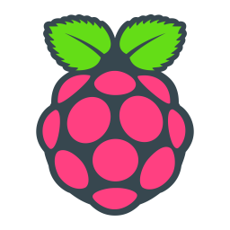

# CozyBaby
[](https://lbesson.mit-license.org/)


## Table of Contents
* [Usage](#Usage)
* [Stack](#Stack)
* [Installation](#Installation)
* [License](#License)

## Description
CozyBaby is my custom solution to monitor the temperature in my baby's room. We live in an old building with manual heat controls, so every night we look at the predicted low temperature for the night, then try to guess what level to set the heaters at and how warmly to dress him. I wanted to see how cold it really is in there, and how much the heat fluctuates based on the outside temperature. I realized that this problem gave me the perfect excuse to buy another Raspberry Pi! (I already have a Zero W that has served as a wireless print server, and is now a BlueTooth receiver for my stereo). 

After some initial research, I settled on using a Raspberry Pi Zero W with an AdaFruit PCT2075 temperature sensor. I don't have a soldering iron, so I went the solder-free route by purchasing a hammer header for the Pi, a STEMMA QT cable, and SparkFun STEMMA QT shim to connect everything together. Every hour, the Raspberry Pi reads the temperature from the sensor, gets the outdoor temperature from Open Weather API, and then uploads both values to an Atlas MongoDB instance. The code for the Raspberry Pi is found in the "raspberry_pi" folder. 

The backend is handled by an AWS Lambda function written in Python. The code for that is found in the "aws_lambda" folder. 
Finally, the React front end is hosted on netlify at https://cozy-baby.netlify.app and the code for that is found in "react_frontend."

This was in concept one of the simpler apps I've created, but allowed me to explore using a Raspberry Pi and dive into the world of serverless functions.

## Usage
Very simple! Just go to https://cozy-baby.netlify.app and take a look!

## Stack
CozyBaby is built with Python, MongoDB, React, Typescript, ChartJS, and AWS Lambda Functions

## Installation
Most of the work of getting this app working was in the setup of the Raspberry Pi and the AWS Lambda. Having successfully fumbled my way through it, hopefully the following description can help anyone hoping to replicate this app locally, or set up something similar.

### First step - Acquiring the materials:

I purchased everything from AdaFruit because I've had good results from them before, but there are many other great vendors as well.
1. [Raspberry Pi Zero W](https://www.adafruit.com/product/3400). I don't need much processing power, so I decided to keep things small and cheap with the Pi Zero. The W model has a built in WiFi card, which makes connecting to your wireless network a breeze.
2. [MicroSD card](https://www.adafruit.com/product/2820). I didn't have a spare one lying around, so I bought one with Raspbian Buster Lite pre-flashed. It's not so much trouble to flash your own image, but since I had to buy a card anyway, why not save myself a step!
3. [PCT2075 Temperature Sensor](https://www.adafruit.com/product/4369). This is where the magic happens. On the product page AdaFruit also has great resources on how to get this little sensor set up with any board. Their documentation is great and was my main source of information for this part of the project.
4. [Hammer Header](https://www.adafruit.com/product/3662). AdaFruit also sells a Pi Zero W with a pre-soldered header. If you have a soldering iron, you can also forgo a header and just solder wires directly to the board.
5. [STEMMA QT 4-pin cable](https://www.adafruit.com/product/4210). This connects your Pi and PCT2075. It's a nice little standardized plug that saves soldering and looking at pin-out diagrams. For my setup I plugged this cable into the SHIM below. For going the soldering route, you can either buy STEMMA QT cable that just has loose wires on one end to solder onto the Pi, or just forgo the plug entirely and solder on both ends using whatever wire you have lying around.
6. [STEMMA QT SHIM](https://www.adafruit.com/product/4463). The final piece in my setup here. This just slots onto the header of the Pi and has a little STEMMA QT plug. I liked going this route for my setup because it eliminates the possibility of not soldering the wires correctly, or putting them in the wrong place. As I get more comfortable with these types of projects I'll probably choose to go the slightly cheaper route.

Speaking of cost, If you've been clicking on the links above you've noticed that this is not an expensive setup. I think all told my final bill was around $40. Amazing! 

We are missing just two things that I assume pretty much everyone has lying around the house in our modern era. A micro USB cable and a power supply. I just used one of the multitude of cables and power supplies that I have lying around from old phones and kindles and other devices. Do just make sure that it's a 5V power supply. Anywhere from 1 to 2.5 Amps seems to be fine. 

Next step, stick it all together!

### RaspberryPi setup: 

For this step just follow the instructions provided with the equipment that you've purchased. If you've purchased the hammer header above, you may consider trimming it down so that you're only installing the pins that you need. It makes for a less bulky setup and you can always save those pins for later. 

Now that you have your temperature sensor connected to your RaspberryPi it's time to get everything up and running! 

I use a headless setup, meaning that I don't plug a keyboard and moniter into my RaspberryPi, I just access it from my MacBook. One way to do this is through SSH. SSH is disabled by default in Raspian, the RaspberryPi operating system. To enable it, plug your sd card into your computer and create an empty file named "ssh" (no file extension) right at the root of the boot partition. If you have multiple partitions, the boot partitian should be the smallest partition and you'll see it contains key operating system files. While we're in there, we can go ahead and set up our wireless credentials. Raspian has a very user friendly utility for configuring wifi credentials and other basic things that can be accessed with the command ` sudo raspiconfig`, but we don't have access to that utility until we can SSH into our Pi. So, we'll do it the manual way just this once. 
Right in the same folder where we created the ssh file, create a file called "wpa_supplicant" and paste the following code into it, filling in your own information.

```ctrl_interface=DIR=/var/run/wpa_supplicant GROUP=netdev
update_config=1
country=<Insert 2 letter ISO 3166-1 country code here (US, for example)> 

network={
 ssid="<Name of your wireless LAN>"
 psk="<Password for your wireless LAN>"
}
```

Great, now we should be good to go! Plug your Pi into power, give it a minute or two to boot up. Meanwhile, we need to find out the IP address of our Pi. There are multiple ways to do this, depending on your local environment. Check out the [RaspberryPi IP Address Docs](https://www.raspberrypi.org/documentation/remote-access/ip-address.md) to see how you can do that. 
(Quick note: If you are on Windows there are some other steps you may need to do as well... The [RaspberryPi Docs](https://www.raspberrypi.org/documentation/remote-access/ssh/) can help you out )

Once you have the RaspberryPi's IP, run this command, pasting in the IP Address.
`ssh pi@<Your IP Address>`

The second command should prompt you for a password (the default is "raspberry"), enter that and you're in!

Now to get the code!

First install git with: `sudo apt-get update`, `sudo apt-get install git`

Then clone this repo with `git clone https://github.com/elijah415hz/cozy-baby.git` 

This will prompt you for your github username and password.

(This is the http link, which is deprecated. But as long as it still works it is perfect for this kind of thing. Do I want to go through setting up an ssh key just to clone this one repo? Not really... If you'd like to go the ssh key route, here is the info on how to do get that set up. [Feel free!](https://docs.github.com/en/github/authenticating-to-github/generating-a-new-ssh-key-and-adding-it-to-the-ssh-agent))

Almost there.

Now, `cd cozy-baby/raspberry_pi`, then `pipenv install`. This will install all necessary dependencies. Then, create a ".env" file with the following contents, filling in the appropriate values.

```
DB_URI = <Your MongoDB URI>
LATITUDE = <Your Latitude>
LONGITUDE = <Your Longitude>
APP_ID = <Your OpenWeather API Key>
```

Oh wait! What's that MongoDB URI about? We're going to need to create a MongoDB instance in order to store our data. Let's jump back into our development computer and get that going. It will just take a minute, and then we'll have that DB_URI that our script needs. We can host it for free on MongoDB Atlas. Follow this link for their tutorial to get setup https://docs.atlas.mongodb.com/getting-started/. Once you've created a collection and have your connection string, bring that back here and paste it into the ".env" as your DB_URI.

We also need to generate an API key for OpenWeather. This is what allows us to get the outside temperature without setting up our own sensor outside. We'll just ask OpenWeather what the temperature is at our Latitude and Longitude. Make an account [here](https://home.openweathermap.org/users/sign_up) and then generate an API Key for the "onecall" endpoint. Bring that key back here and add it to the ".env" file.

If you don't happen know your Latitude and Longitude offhand https://www.latlong.net/ can help.

Now we need to bring in Cron. Cron enables us to run jobs on a schedule on Unix/Linux machines, often used for dev-ops purposes. We're going to use it to call our "log_temperatures.py" script every hour. If you'd like more granular data, that's easy as well. For our purposes we'll just run `crontab -e` and add the following line:
```0 * * * *  /cozy-baby/raspberry_pi/log_temperatures.py```

It may ask you to select an editor to open, I like nano.

Change the path to the file if you've cloned the repo anywhere but the root of your Pi. 

This line just tells cron to run our script at the "0" minute of every hour of every day of every week of every month. If you'd like to run it every minute, change that first "0" to a "*". Write "*/5" to run every 5 minutes. [CrontabGuru](https://crontab.guru/) is a great place to play around with different settings for your crontab.

One final step, and we'll be all set up as far as the RaspberryPi is concerned. 
We need to activate i2c on our Pi so that it can read the data from our AdaFruit sensor. Raspian's `sudo raspiconfig` command makes this easy. Follow the screenshots [here](https://www.raspberrypi-spy.co.uk/2014/11/enabling-the-i2c-interface-on-the-raspberry-pi/#:~:text=Method%201%20%E2%80%93%20Using%20%E2%80%9CRaspi%2Dconfig%E2%80%9D%20on%20Command%20Line&text=Highlight%20the%20%E2%80%9CI2C%E2%80%9D%20option%20and,activate%20%E2%80%9C%E2%80%9D.&text=The%20Raspberry%20Pi%20will%20reboot%20and%20the%20interface%20will%20be%20enabled.) for an easy walk-through.

Ok! Done with the RaspberryPi. Assuming we did everything correctly, we should start seeing values come into our MongoDB that we created earlier. Jump over to your Atlas account to confirm that the values are flowing. If you're only uploading every hour, you may have to wait a while. Maybe a good idea to reduce that interval in your crontab for testing purposes.

Next we'll set up our AWS Lambda function. Clone the repo again using the `git clone` command above, but this time on your main computer. If you're not running headless on your RaspberryPi and have access to the GUI, you can skip this step. Otherwise, this will just make your life much much easier than trying to get files off of your headless Pi.


### AWS Lamda: 
First, we'll need to create an account. Go to https://aws.amazon.com/ and Click "Create and AWS Account" or "Sign in to the Console," whichever one you see. Follow the instructions to create an account. 

Once you're in, search in the top search bar for "lambda" and hit "enter." 

Then, at the top left click "Create a function." 

Select "Author from scratch," give your function a name (cozyBaby, maybe? :) ), and select "Python 3.7" as the runtime. Then click "Create Function."

Once the code editor opens, click "Upload from" and select ".zip." Navigate to `Cozy-Baby/aws_lambda` and select `lambda-deployment-package.zip`. 

You'll see that this function also needs that MongoDB connection string in order to access our database. Go find that, and bring it back here. Find the "Configuration" tab, then select "Environment Variables." Add an environment variable named "DB_URI" at set the value to your connection string and save.

So, now our function is up there in the AWS clouds, but we have no way to access it. We need to set up an API trigger. Toward the top of the page, click "Add Trigger." Select "API Gateway" and below select "Create an API." Leave the type as HTTP. Under Security select "Open," then expand "Additional Settings" and enable Cross Origin Resource Sharing (CORS). This will enable us to hit this API endpoint from our frontend. We're obviously leaving everything pretty open security-wise, but I don't consider the temperature of my home to be very sensitive data, so I'm not too worried. 

Once the trigger is created it will appear in our "Triggers." Expand the details on our trigger and click on the "API Endpoint" to do a quick test. If you get back a list of time and temperatures in JSON format then it's working. Copy that API Endpoint address and hold onto it. We're going to need it in a minute.

Our serverless function is now working and retrieves data from our database. Now we just need to get our frontend up and running so we have a nice way to view our data.


### Netlify: 
Netlify is a nice easy, free way to deploy simple applications. They also have their own serverless functions that are worth looking into. At the time of writing this, they did not support Python serverless functions, so I went my own way. 

First off, make an account at https://www.netlify.com/.

Once you've done that, we're going to install the netlify cli to make things easy.

Run: `npm install netlify-cli -g`

Then, cd into the `react_frontend` directory and run `npm i`

Next, run `REACT_APP_BACKEND_API=<Your AWS API Endpoint> npm run build` inserting the API Endpoint that we copied above.

and `npm run build`

Finally, run: `netlify deploy --dir=./` This will open a browser window for you authenticate with your brand new netlify account. Once you've authenticated, close the window and come back to your terminal. Following the prompts, select "Create & configure a new site". Select your team (You will likely only have one choice here) and give your site a name. This will become part of the url for your app, so make it something easy to remember.

Netlify will now give you a Website Draft URL. Click that to make sure that everything is looking good. If it is, run `netlify deploy --prod` to deploy it for real. Make note of the url that it gives you because that is how you'll access your site. 

That's it! Enjoy knowing what the temperature is whereever you choose to place your sensor!

Remember, this is a progessive web app, so feel free to install it on all of your devices for quicker access.


## License
[](https://lbesson.mit-license.org/) 

This application is covered by the [MIT license](https://lbesson.mit-license.org/).
